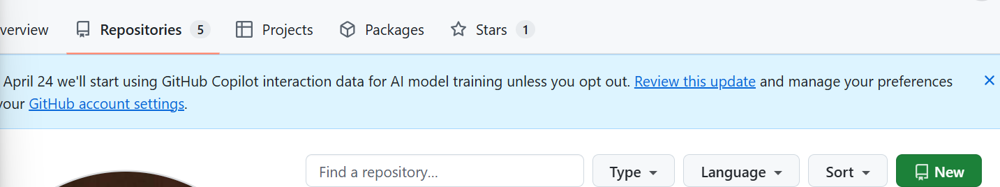

# git使用指南

Author：MuBurn          Start date：2026.5.8

[TOC]

## 如何理解git仓库？

在这里我让AI用游戏存档来比喻git仓库，并给出了通俗解释，让人更容易理解git的一些命令（这里只是提供理解与命令行相关代码，VS Code的操作放在后面统一看）

| Git 操作&&一些名词                                 | 游戏存档比喻                                                 | 通俗解释                                                     |
| -------------------------------------------------- | ------------------------------------------------------------ | ------------------------------------------------------------ |
| **远程仓库 (origin)**                              | 游戏官方云端存档库                                           | 所有人共用的 “终极存档库”，存着项目最终版、大家都能访问的代码 |
| **本地仓库**                                       | 你电脑里的单机游戏本地存档                                   | 只有你能改，断网也能玩 / 写代码，改坏了只影响自己            |
| **分支 (branch)**                                  | 存档的 “平行宇宙”： - main 分支 = 游戏官方最终通关存档 - feature 分支 = 你开的新存档（练新角色 / 打新副本） | 不同分支互不干扰，练新功能（玩新角色）不会弄坏最终版存档（通关存档） |
| **初始化仓库（git init）**                         | 新建游戏存档文件（首次玩游戏时创建本地存档）                 | 在文件夹里初始化 Git，让这个文件夹变成 “能存代码存档” 的本地仓库 |
| **暂存更改（git add）**                            | 保存游戏进度（把当前操作 “暂存”，标记要存档的内容）          | 告诉 Git：“我要把这些代码修改加入到待存档列表里”             |
| **提交（git commit）**                             | 保存本地存档（给当前进度打个 “存档点”，写清楚存档备注：比如 “打完第 3 关”） | 把暂存的代码修改，生成一个本地存档版本，附带备注（比如 “完成电机控制功能”） |
| **拉取（git pull）**                               | 读取云端最新存档 + 合并到本地（同步官方最新进度）            | 把云端仓库的最新代码（别人改的）拉到本地，更新你的本地存档   |
| **推送（git push）**                               | 把本地存档上传到云端（让所有人看到你的进度）                 | 把本地提交的代码版本，推送到远程仓库，同步给团队其他人       |
| **签出（git checkout -b 分支名）**                 | 复制当前存档，开一个新的平行宇宙存档（比如 “从通关存档复制，练法师角色”） | 基于当前分支（比如 main），新建并切换到新分支，新分支有原分支的所有代码 |
| **合并分支（git merge 分支名）**                   | 把 “练法师的存档进度” 合并到 “通关存档”（法师满级后，把进度整合到主存档） | 把功能分支的代码，合并到 main 分支，让新功能进入最终版代码   |
| **储藏暂存git stash**                              | 临时存档（打 BOSS 前先存个临时档，不想保存当前瞎试的操作）   | 把未提交的代码修改临时存起来，让工作区回到干净状态，后续可恢复 |
| **添加远程仓库（关联）git remote add origin 地址** | 绑定本地存档到官方云端（告诉本地存档：“你的云端同步地址是这个”） | 把本地仓库和远程仓库关联，后续才能推送 / 拉取                |
| **抓取（git fetch）**                              | 下载云端所有最新存档信息到本地，但不合并到你正在玩的存档（只看更新，不影响当前进度） | 获取远程仓库的最新内容                                       |
| **git switch**                                     | 相当于 “切换游戏存档的平行宇宙”—— 比如从「练法师的 feature 分支存档」切回「main 主线存档」，或从主线切到新的功能存档。 | 查看/切换分支                                                |
| **克隆仓库（ git clone） **                        | 从官方云端，把完整游戏存档**下载到本地**                     | 第一次获取项目：直接复制远程仓库所有代码到本地电脑           |
| **合并分支（ git merge）**                         | 把「测试存档的进度」合并到「最终通关存档」                   | 将功能分支的代码，整合到主分支（完成功能上线）               |

**在这里要提一下git stash 与 git add的区别**：


**在这里AI的进一步解释**是：

| 命令        | 中文核心释义               | 游戏存档比喻                                                 | 核心用途                                                     |
| ----------- | -------------------------- | ------------------------------------------------------------ | ------------------------------------------------------------ |
| `git add`   | 暂存「要提交的修改」       | 玩游戏时，选中 “打完第 3 关、捡新装备” 这些进度，标记为「要保存到正式存档的内容」 | 为 `git commit` 做准备，把修改纳入 “待正式存档” 清单（还在工作区内） |
| `git stash` | 暂存「不想提交的临时修改」 | 打 BOSS 前，先把 “瞎试的操作、没打完的进度” 临时存起来（不进正式存档），先切去打主线 | 临时藏起未完成的修改，让工作区变干净（比如拉取远程代码、切分支） |

**个人理解**：就实际应用的时候来说：git add 是我们每次 commit 前都要进行的操作，只有暂存更改之后我们才能提交。而git stash 一般是用在我们本地修改了一些文件，但是这个时候远程仓库有更新，我们想要拉取远程仓库最新的代码，如果直接拉取会失败（会提示你清理工作区），需要先暂存文件再拉取。[ctrl+鼠标左键点击这里跳转到示例](#git stash)

```bash
# 1. 初始化本地仓库（第一次）
cd 你的项目文件夹
git init

# 2. 关联远程仓库
git remote add origin https://github.com/用户名/仓库名.git

# 3. 拉取远程最新代码（同步云端存档）
# 格式：git pull 远程仓库名称 分支名
git pull origin main

# 4. 创建功能分支并切换
git checkout -b feature/电机控制

# 5. 写代码后暂存所有修改
git add .

# 6. 提交本地修改（打存档点）
git commit -m "完成电机控制基础功能"

# 7. 推送功能分支到远程
git push -u origin feature/电机控制

# （若中途需拉取远程代码，先暂存未完成修改）
git stash push -m "暂存未完成的调试代码"
git pull origin main
git stash pop  # 恢复暂存的修改

# 8. 功能完成后，合并到main分支
git checkout main
git merge feature/电机控制
git push origin main

# 9. 从所有远程抓取
git fetch --all

# 10. 多个远程仓库时

# 查看所有远程仓库的名称和地址（fetch/push地址）
git remote -v

#输出示例（这里的github 与 gitee 是仓库别名也就是命令行中git remote add后紧跟的那一项）
github    https://github.com/你的用户名/仓库名.git (fetch)
github    https://github.com/你的用户名/仓库名.git (push)
gitee     https://gitee.com/你的用户名/仓库名.git (fetch)
gitee     https://gitee.com/你的用户名/仓库名.git (push)

# 格式：git pull 远程仓库名称 分支名
# 也可以把  https://github.com/你的用户名/仓库名.git 放在远程仓库名称所在的位置
git pull github main
git pull https://github.com/你的用户名/仓库名。git main  # 拉取github这个远程仓库的main分支代码

git remote set-url gitee https://gitee.com/你的用户名/新仓库名.git #修改关联的远程仓库

# 11.切换分支
#git switch
git switch [选项] [分支名/提交ID/文件路径] #基础语法

# 切换到main分支
git switch main

# 切换到feature/电机控制分支
git switch feature/电机控制

# 恢复当前分支的main.c文件到最新提交的状态（撤销未提交的修改）
git switch -- main.c

# 恢复main.c文件到指定提交ID的状态
git switch 1a2b3c4 -- main.c

# 12. 克隆项目
git clone https://github.com/xxx/项目名.git #http
git clone git@github.com:用户名/仓库名.git #ssh

# 13. 合并分支
git merge 分支名
```


## git项目建议（仅供参考）

### 一、仓库原则

一个项目只建一个 Git 仓库，所有功能、所有代码都放同一个仓库，靠**分支**做功能隔离，不用拆多个仓库。

### 二、远程固定分支

**main**
作用：项目最终稳定版、上线版、完整版代码
规则：不在 main 直接写代码，只做合并、打版本，永远保持干净可运行。
**dev**
作用：开发汇总分支，所有功能分支先合并到 dev，测试稳定后再合到 main。

### 三、功能分支命名规范

1. **功能开发分支**

格式：`feature/功能名`

举例：

- `feature/电机控制`
- `feature/串口通信`
- `feature/摄像头驱动`
- `feature/蓝牙配网`

2. **bug 修复分支**

格式：`fix/问题描述`

举例：

- `fix/串口乱码`
- `fix/电机启停抖动`

3. **文档 / 配置分支**

格式：`docs/内容`、`config/配置调整`

### 四、本地分支对应规则

> **远程有什么分支，本地就建同名分支**

- 远程：`feature/电机控制` → 本地也建：`feature/电机控制`
- 好处：自动关联。

### 五、标准开发流程

每次做新功能，从最新 main 拉一条新功能分支
本地在 feature/xxx 写代码、提交、调试
写完推送到远程同名 feature/xxx
测试没问题，合并到 dev 再测试
全部稳定后，合并到 main
main 永远是项目完整、最终可用的代码


## 创建一个仓库并执行一些有关git的操作（两种方式）

展示两种方式：命令行有关git指令，Vs Code图形化界面

### 创建远程仓库

直接在GitHub创建



点击绿色按钮，即可创建，仓库的具体配置按照自己需求即可，这里不过多说明。

### Vs Code图形化界面&&git 命令行（以图形化界面为主）

#### 1. 本地初始化 Git 仓库

打开需要上传到远程仓库的文件夹，在 VS Code 左侧菜单栏点击「源代码管理」图标（分支样式），点击「初始化仓库」，完成本地 Git 仓库的创建。

#### 2.添加远程储藏库（远程仓库）


找到远程，里面有添加远程储藏库


选择刚刚创建的仓库（要登陆GitHub）


一般初始化命名都给origin 对应的命令是：

origin 就是我们自定义的名字

```bash
git remote add 自定义名字 仓库地址
```

对应命令行

```bash
git remote add origin https://github.com/你的用户名/你的仓库名.git

# 查看已关联的远程仓库
git remote -v

# 正确输出
origin  https://github.com/你的用户名/你的仓库名.git (fetch)
origin  https://github.com/你的用户名/你的仓库名.git (push)
```


添加完成后点击存储库中树状图形旁的main，在这里你可以看到远程分支和本地分支。

首次关联时，需点击远程分支`origin/main`（即「签出到远程分支 origin/main」）

也就是我们说的关联到远程仓库

```bash
git checkout origin/main  # 检出远程main分支到本地
```

#### 3.拉取，提交，推送

##### 拉取

通常来说，不管做什么，我们都要先拉取


**实线向下的箭头表示拉取，向上的表示推送，虚线向下表示抓取**，树杈状可以选择要查看的分支

**比较常用的界面是更改**：这里有我们在本地仓库中更改的文件，可以看到现在我们对git使用指南做了一些更改


###### git stash

我们本地修改了一些文件，但是这个时候远程仓库有更新，我们想要拉取远程仓库最新的代码

这里我用实际遇到的一个工程举例：


我们可以看到main分支中有7个需要拉取，1个可以推送，并且我们此时更改了一个文件，此时拉取会报错。


此时我们可以暂存我们的更改，然后储藏中**储藏暂存（git stash）** 填入储存信息

拉取后弹出储藏，选择自己需要弹出的储藏即可，弹出后可能会有合并更改，选择自己想要的即可。


##### 提交

在消息里可以写提交信息（若要提交必须写），写完提交消息后，你可以先暂存更改，然后再提交，也可以直接点提交，他会提示你是否需要暂存更改（必须先**暂存更改**，填写提交信息后才能提交（commit））。

**右键点击修改的文件，选择暂存更改，或者点击文件旁边的加号**


可以看到图表已经出现了我们提交的消息，但这是在本地仓库。

##### 推送

现在我们需要推送到远程仓库，你可以点击推送，也可点击同步更改（本质是先拉取再推送，其实你可以在显示main分支图形的右侧看见0↓1↑，0拉取，1推送）这是非常合理的。


可以看到远程仓库中已经生成了我们提交的信息了。

```bash
# 拉取远程代码
# 格式：git pull 远程仓库名称 本地分支名
git pull origin main

# 推送功能分支到远程
#格式 git push -u 远程分支名 本地分支名
git push -u origin feature/电机控制 #第一次推送 （远程仓库如果没有该分支，如果存在同名分支直接用git push 即可）
git push #后续推送 

git branch  #查看分支名字 带 *号 的是当前分支

#提交
git add . #暂存所有更改
git commit -m "这里写你做了什么修改" #提交更改
```


#### 4.创建，发布，删除，合并分支

##### 创建分支

为了演示后续合并分支操作我创建了一个新的分支merge_branch_test

点击存储库中树状图形旁边的main（**这里也可以切换分支**）


或者说储存库旁边三个点


选择分支，创建新分支。**后续有关操作我就不在放图片了，不然显得有点啰嗦**。

对应代码

```bash
git switch -c 你的分支名 #创建并切换到对应分支
```


##### 发布分支

发布分支是**针对远程没有与本地分支同名**的情况而言的。（前提你要有发布分支的权限）

它实际上不只是一个步骤，在这里我通过结合命令行的形式加以解释整个流程：

```bash
#较为标准的流程是这样
# 1. 创建并切换分支
git switch main
git pull  #这两步是为了同步最新的内容
git switch -c release/v1.0 #切换到要发布的分支

# 2. 提交(如果有更改)
git add .
git commit -m "发布v1.0"

# 3. 发布
git push -u origin release/v1.0
```

但是你运用Vs Code 的时候点击发布分支实际上就是对应的第三步（这个主要看个人理解）

点击发布分支即可


这时我们看见远程仓库中已经有了对应的分支。

##### 删除分支

删除不必要的分支

**首先切换到除需要删除分支以外的其它分支**，然后删除分支即可


点击删除分支


删除后我们再点击树状图形，看到本地已经没有分支了


你也可以在图表中右键点击某分支最新提交的一条，删除分支。


**如果你要删除远程分支**可以采用同样的方式（前提是你要有权限，在后面的问题中我会提到）

命令行代码

```bash
git switch 非要删除的分支名 

#本地分支删除
git branch -d 分支名 #安全删除(该分支已被合并)
git branch -D 分支名 #强制删除(该分支未被合并)

#远程分支删除
git push 远程名 --delete 分支名
```


##### 合并分支

**我增加了一些冲突内内容（Git 冲突 = 同一文件、同一位置，被两个分支改成了不一样的内容）并且模拟了多人协作过程中出现的一种特殊情况，使情况更加真实**：可以看到有个猪头MuBurn 在我创建merge分支的时候，它创建了一个delete_test分支把一部分**重要内容**给删去了，然后它给合并到了main分支，**导致现在的main分支被删去了一部分文件**（留意这里）

比如相对于

图片中第三个蓝色节点，在mergebranch 中，我删去了这里的首次

在main中我将首次改为第一次，现在让我们来看看合并分支的情况。


如图所示选择合并分支，在弹出的弹框中选择merge分支（分支A）


现在我们看见，出现了合并冲突，我们需要合并更改


比较后选择合适的更改，然后点合并更改中的加号即可暂存更改


暂存更改后修改提交信息，点击继续，即可完成合并分支。


可以看见，分支已经合并完成。合并分支完成后，可以删去merge_branch_test(分支A)，如果你不再需要它。如果你不小心合并错了分支可以在命令行中输入：

```bash
git reset --hard HEAD~1
```

来取消合并（没有推送到远程）

**在这个时候我们重新看到main分支下的资源管理器**


我们发现并没有被猪头MuBurn删除的文件！我们聚焦图表，可以看到被删除的git使用指南pdf已经helloworld.c**没有**在合并的时候合入main.c！！！


这是因为Git的隐藏机制

**Git 认为：main 已经明确删除了这些文件**

**你合并进来的内容，不允许自动恢复它们！**

这不是 bug

这是 Git **保护主线不被意外恢复已删文件** 的机制。

这时我们要恢复这俩个文件可以采用命令行

```bash
git checkout 分支名 -- 文件名

git checkout merge_branch_test -- mergebranchtes\hello.world.c
PS C:\Users\13981\Desktop\university\git_tips> git checkout merge_branch_test -- "git使用指南&&git仓库的储存建议（小项目）.pdf" 
```

然后提交更改即可，可以看到文件已经恢复。


鉴于这种情况，为防止有人乱改main分支的代码我们可以修改仓库的一些设置，来避免

[跳转到仓库权限设置（ctrl+鼠标左键点击这里）](#仓库权限设置)

#### 5.克隆仓库


## 仓库权限设置

### 仓库权限

为了防止像MuBurn一样的蠢蛋对重要的分支到处修改让我们最终的代码变得丑陋，我们可以设置仓库的规则，来限制协作者。

在Git Hub 中点击Settings->Rules->Rulesets

创建一个新的ruleset0


Name 按自己的喜好取即可，我们主要在Target branch中添加 default branch 保护我们的默认分支


在下面的设定中勾选这个选项，主要是在合并分支前，需要提交一个**pull request（后续简称pr）**，经过同意后才能合并（注意，开启这个选项之后，你的本地main分支在实际意义上已经变成了**"只读"**分支，虽然你仍能够修改本地的main分支，但是**你已经无法将它推送到远程仓库**。因此，**正确的做法是抓取和拉取远程的main分支，然后再在这个基础上创建一个新的分支，在这个新分支上修改，最后提交pr**）


也可以根据需求选择

限制创建分支，跟新分支，删除分支。（这些操作都是针对远程仓库的，本地分支你想怎么改就怎么改）


改完后激活它即可。

现在我们可以看到MuBurn 在本地main合并delete_try之后想要推送到主分支的时候就出现了报错！


这里我们就要提交pr了

#### 提交pr

我们可以在GitHub上提交pr也可以在Vs Code 上装插件GitHub pull request 插件。这里两种方式都简单介绍一下

##### GitHub提交pr

##### VsCode提交pr

## 提交规范


## 常见问题

#### 1.创建了本地分支，并且也有远程的同名分支，但是无法拉取

一般是因为没有将本地分支与远程分支关联

可以在命令行中输入如下代码解决

```bash
git branch -u 远程分支名字
```


#### 2.我提交错了一些文件想回到上一步

```bash
#撤销上一次的 git 提交记录，回退到上一个版本
git reset --soft HEAD~1

#完全放弃当前所有修改
git reset --hard HEAD~1
```

